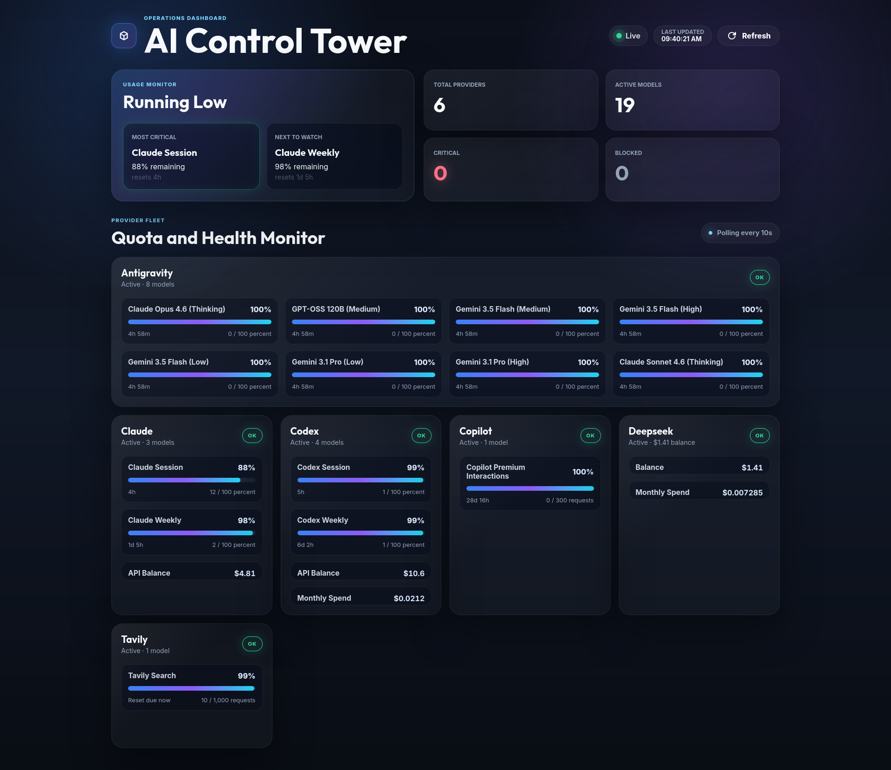

# AI Control Tower

> Personal dashboard for monitoring quota usage across multiple AI providers in real time — from a single interface, without switching tabs.

When you work with multiple AI providers simultaneously, quota management becomes a daily friction point. You hit a rate limit mid-session, switch to another model, forget which one was about to reset, and lose context. AI Control Tower solves this by exposing a unified live dashboard — provider health, quota progress bars, and low-quota alerts — polling every 10 seconds from a lightweight local server.



---

## What It Monitors

| Provider | What you see |
|---|---|
| **Claude** | Session quota (% used), 5h window reset time, optional API prepaid balance |
| **DeepSeek** | API balance + optional monthly spend |
| **Tavily** | Search credit usage from session cookie or API key |
| **Codex CLI** | Auth token from `~/.codex/auth.json` + optional API balance |
| **Antigravity (Codeium)** | Local language server process — no credential needed |

Every connector reports a unified health status: `OK` · `WARNING` · `CRITICAL` · `BLOCKED`.

---

## Architecture

```
Browser dashboard (SPA)
        │ polls every 10s
        ▼
Fastify API server (src/index.ts)
        │
        ▼
ConnectorFactory
(static registry — resolved by provider name at runtime)
        │
        ├── ClaudeConnector
        ├── DeepSeekConnector
        ├── TavilyConnector
        ├── CodexConnector
        └── AntigravityConnector
              │
              ▼
        BaseConnector
        (abstract + in-memory TTL cache)
        ↓
        fetchMetricsRaw() → ProviderMetrics
```

The dashboard is a dependency-free SPA (`public/index.html` + `app.js` + `style.css`). No framework, no build step — just fetch and render.

### Unified metrics schema

Every connector returns the same shape:

```typescript
interface ProviderMetrics {
  provider: string;
  status: 'active' | 'inactive' | 'error';
  health: 'OK' | 'WARNING' | 'CRITICAL' | 'BLOCKED';
  models: ModelMetrics[];
  resetAt: string | null;
  lastUpdatedAt: string;
}

interface ModelMetrics {
  modelId: string;
  modelName: string;
  quota: MetricQuota;
  resetAt: string | null;
}

interface MetricQuota {
  type: 'tokens' | 'requests' | 'credits' | 'percent' | 'currency';
  total: number;
  used: number;
  remaining: number;
}
```

Adding a new provider means implementing one method — `fetchMetricsRaw()` — and registering the connector. The dashboard and API pick it up automatically.

---

## How Credentials Work

No credential is extracted, generated, or shared. The connectors reuse what is already present on your machine after a normal browser login — the same cookies and tokens your browser stores, the same way a DevTools session or browser extension would.

**To retrieve session credentials:**
1. Log in to the provider's website
2. Open DevTools → Network → reload
3. Click any authenticated request → copy the `Cookie` or `Authorization` header

Every variable in `.env` is optional — leaving one blank causes that connector to report `inactive` instead of erroring.

---

## API

### `GET /v1/providers`

Health summary for all registered providers:

```json
{
  "claude": "OK",
  "deepseek": "OK",
  "tavily": "OK",
  "codex": "CRITICAL",
  "antigravity": "BLOCKED"
}
```

### `GET /v1/providers/:name`

Full `ProviderMetrics` object for a single provider. Returns `404` if unknown.

### `GET /v1/models/best-match`

Returns the two coding-assistant models with the most depleted quota — useful for automatically routing tasks to the model with the most headroom. Excludes non-coding providers and informational-only metrics.

```json
{
  "first": {
    "provider": "claude",
    "modelId": "claude-5h-window",
    "modelName": "Claude Session",
    "remaining": 44,
    "total": 100,
    "type": "percent",
    "health": "OK",
    "resetAt": "2026-06-01T13:40:00Z"
  },
  "second": { "..." }
}
```

### `GET /health`

Liveness check — returns `{ "status": "ok" }`.

---

## Setup

```bash
git clone https://github.com/simonecamerano/ai-control-tower.git
cd ai-control-tower
npm install
cp .env.example .env
# Fill in credentials for the providers you use
```

### Running

| Command | Description |
|---|---|
| `./launch.sh` | Start server and open dashboard in browser |
| `npm run dev` | Start server in watch mode only |
| `npm run build` | Compile TypeScript to `dist/` |
| `node dist/index.js` | Run compiled production build |

Server listens on `http://localhost:3000` by default.

### Testing

```bash
npm test             # run suite once
npm run test:watch   # watch mode
```

---

## Adding a New Connector

```typescript
// 1. Create src/connectors/myprovider.ts
export class MyProviderConnector extends BaseConnector {
  constructor() { super('myprovider'); }

  protected async fetchMetricsRaw(): Promise<ProviderMetrics> {
    // fetch quota data, return ProviderMetrics
  }
}
```

Then register in `src/connectors/index.ts`, add env vars to `src/config.ts` and `.env.example`, and write `src/connectors/myprovider.test.ts`. The dashboard and API pick up the new provider automatically on next restart.

---

## Project Structure

```
ai-control-tower/
├── src/
│   ├── index.ts                    Fastify server entry point
│   ├── config.ts                   Environment variable loading
│   └── connectors/
│       ├── base.ts                 Abstract base + TTL cache
│       ├── factory.ts              Static connector registry
│       ├── index.ts                Connector registration
│       ├── claude.ts
│       ├── deepseek.ts
│       ├── tavily.ts
│       ├── codex.ts
│       └── antigravity.ts
├── public/
│   ├── index.html                  Dashboard SPA
│   ├── app.js                      Polling + render logic
│   └── style.css
├── docs/
│   └── screenshot.png
├── .contextforge/                  Project memory layer (ContextForge)
├── .env.example
├── launch.sh
└── roadmap.md
```

---

## Disclaimer

This project is a personal tool built for educational and demonstration purposes. It performs no write operations, purchases, or actions on any provider platform — only reads quota and usage data that the authenticated user is already entitled to see through their own accounts. If you use this project, you are responsible for ensuring your use complies with the terms of service of each provider you connect to.

---

## Author

**Simone Camerano** — AI workflow engineer and full stack developer.

- 🌐 [simonecamerano.dev](https://simonecamerano.dev)
- 💼 [linkedin.com/in/simone-camerano](https://linkedin.com/in/simone-camerano)
- 🐙 [github.com/simonecamerano](https://github.com/simonecamerano)

---

## License

MIT